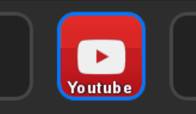
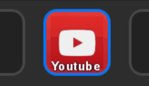
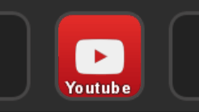
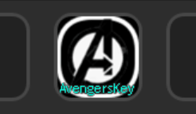
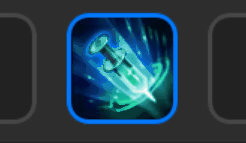

# Avengers Key Plugin

#### Make your own key with animatable graphic effects. Multiple functions are also supported.

## Animatable Effects
You can add multiple animation effects **ordered by layer** in the effect property inspector.  
Make your own animation effects for your customized icon in stream deck !  

### Circle Spread
Spreads out with a circle. It can be used as touch feedback effect in your icon.  

- Configurate color/alpha, delay/duration.

### Color Overlay
Makes Color overlay layer on your base image.  

- Configurate color/alpha, delay/duration.

### Flash
Flash the icon with color. It can be used as touch feedback effect in your icon.  

- Configurate color/alpha, delay/duration.

### Pie
Draws Pie with color.  

- Configurate color/alpha, delay/duration.
- Configurate grow/eat option and direction:Clockwise/Counter clockwise.

### Border Wave
Draws Moving waves on the border of the base image.  
  

### Blend Grayscaled Image
Blend with grayscaled image of the current input image.  
Note that this effect can only be shown at top of the list due to rendering order.
  

## Effect Combination Examples
Each effect will be drawn **ordered by layer** in the effect property inspector.  

### Example. Effect Combination
Example of an avengers key icon with effect combination.  
  
Configure every effects on your needs.

### Example. Skill Icon like in game
Example of a Skill icon in game.  
  
Cooltime as pie, Duration as border wave and color overlay, touch feedback as circle spread, Cooltime-end feedback as flash.  

## Functions
You can add multiple functions **ordered by layer** in the function property inspector.  
Make your own action for your customized icon in stream deck !  

### Open File/Folder
Opens File or folder.  
Put path of a file or a folder.  

### Open Webpage
Opens webpage like google.com  
Put address of a website.  

### Execute Command
Executes a command prompt.  
Put command like "shutdown -s -t 3600"  

### Key Combination
Dispatches Keystroke event. It can be used as a keyboard macro.  
Note that some applications may block the keystroke by its security issue.  
- Record a key combination to be dispatched.
- Put duration and interval if you want to dispatch the keystroke recursively.

### Type Text
Text typing macro. It can be used as a keyboard macro.  
- Write a text to be dispatched.
- Put duration and interval if you want to dispatch the text recursively.

### PlaySound
Plays the sound file. (mp3, wav, ..)  
- Put the sound file path to be played.

# Note
- Base Image Upload  
Do not upload image from stream deck menu manually.  
Use "Base Image : Update" button in the property inspector instead.  

# Support
**Issue/Bugs:** Post an issue in [GitHub](https://github.com/artrointel/streamdeck-avengers) with reproducible scenario if possible  
**Discussions/Suggestions:** DM to @artrointel in #developers-chat in Discord: [Bar Raiders](https://discord.gg/khpafQa) for quick reponse

# Change Log
### Version 1.1.0 is Out !
- Effect: Added "Blend Grayscaled Image"
- Function: Added "PlaySound"
- Performance Update for Rendering and Functions
- Minor Bugfixes around rendering issues
- It Supports the previous version 1.0.0

### Version 1.0.0 is Out !
- Initial release for the Avengers Key.

# Platform
- Windows 10

# Future items
Just take a look at below items that could be implemented in future.  

- Image: animated gif support as base image (in ver1.x, postponed due to streamdeck issue)
- Image: lottie animation support as base image (in ver2.x)
- Effect: image blending animation effect (in ver1.x)
- Others: auto loop the key, dispatch event to the other avengers key

# Known Issues
- My recreated avengers key keeps previous cached data !
This can be occurred whenever you try to remove/create/move with same position in stream deck.  
This is due to an internal library issue. it will be resolved in future.  
Please remove the key first and restart streamdeck and create new one manually for this case.  